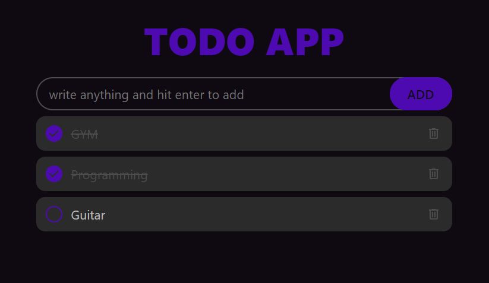

# Todo App

This Todo App is a simple web-based application that allows users to manage their daily tasks. It is designed with a minimalistic approach and provides essential features like adding, completing, and deleting tasks. The app stores your tasks in the browser's local storage, ensuring that your tasks persist even after you close the browser.

## Features

- **Add Todo**: Enter a task in the input field and press "Enter" or click the "ADD" button to add it to your list.
- **Mark as Completed**: Click the checkbox next to a task to mark it as completed. Completed tasks will be crossed out.
- **Delete Todo**: Click the trash can icon next to a task to delete it from your list.
- **Persisted Data**: All tasks are saved in local storage, meaning your tasks will remain even after you close and reopen the app.

## Technologies Used

- **HTML**: For the structure of the web page.
- **CSS**: For styling the application.
- **JavaScript**: For the functionality of the todo app, including adding, deleting, and marking tasks as completed.
- **Local Storage**: For saving and retrieving the list of tasks so they persist across sessions.

## How to Use

1. Clone or download the repository.
2. Open the `index.html` file in your browser.
3. Start adding your tasks using the input field.
4. Mark tasks as completed by clicking the checkbox.
5. Remove tasks by clicking the delete button.

## Screenshots

---

### Short Description for GitHub Repository

